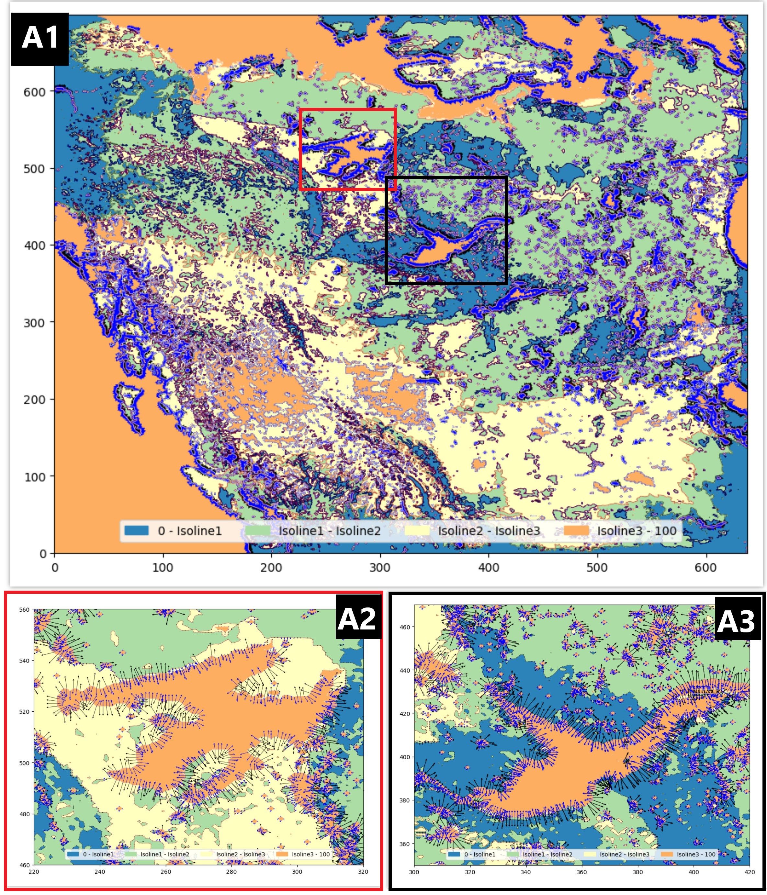

# ContourDiff
# Abstract
Changes in geological processes that span over the years may often go unnoticed due to their inherent noise and variability. Natural phenomena such as riverbank erosion, and climate change in general, is invisible to humans unless appropriate measures are taken to analyze the underlying data. Visualization helps geological
sciences to generate scientific insights into such long-term geological events. Commonly used approaches such as side-by-side contour plots and spaghetti plots do not provide a clear idea about the historical spatial trends.

To overcome this challenge, we propose an image-gradient based approach called ContourDiff. ContourDiff overlays gradient vector over contour plots to analyze the trends of change across spatial regions and temporal domain. Our approach first aggregates for each location, its value differences from the neighboring points over the temporal domain, and then creates a vector field representing the prominent changes. Finally, it overlays the vectors (differential trends) along the contour paths, revealing the differential trends that the contour lines (isolines) experienced over time.

We designed an interface, where users can interact with the generated visualization to reveal changes and trends in geospatial data. We evaluated our system using real-life datasets, consisting of millions of data points, where the visualizations were generated in less than a minute in a single-threaded execution. We show the potential of the system in detecting subtle changes from almost identical images, describe implementation challenges, speed-up techniques, and scope for improvements. Our experimental results reveal that ContourDiff can reliably visualize the differential trends, and provide a new way to explore the change pattern in spatiotemporal data. The expert evaluation of our system using real-life WRF (Weather Research and Forecasting) model output reveals the potential of our technique to generate useful insights on the spatiotemporal trends of geospatial variables.

# Libraries used for Implementation
1. Pandas - 0.23.4: This module is used to create a dataframe from the input CSV files to do further analysis and computation.
2. Numpy - 1.15.4: This module is used to create 2-dimensional arrays from the dataframe and perform the required computation before plotting the resultant values as a figure.
3. Matplotlib - 3.0.2: This module is used to display figures from computation performed based on user input.
4. Shapely - 1.6.4: This module is used to create the polygons.
5. Scipy - 1.3.0: This module is used for polygon simplification.
6. PyQt5 - 5.13.0: This module is used to build the Graphical User Interface.
7. Scikit Image - 0.16.2: This module is used to read as well as processes RGB images into greyscale and transform them into matrices.
8. Time: This module is used to calculate the time and analyze time complexity of different functions of the process.
9. Seaborn 0.9.0 & This module is used to display the data distribution

# Dataset Description
1. We have used Weather Research and Forecasting (WRF) model output as a case study. WRF has been one of most used and steadily growing atmospheric model for research and numerical weather prediction with over 36,000 registered users and over 1,340 peer reviewed publications. The observed dataset contains data values related to 26 parameters from January 2013 to September 2015 over western Canada (latitude X longitude). As a case study for this research, we examine Soil Moisture (SMOIS) and Soil Water (SH2O) parameters using March 2013, March 2014 and March 2015 dataset to show trends. The dataset for each month used for this work has the size 639 X 699 with a resolution of 4km. Each dataset for a month has 446,662 rows and 29 columns. 

2. We have also used an image dataset to visualize the changes in almost identical human motion images. 

# Input Data Format
Our system can use more than one input file at once. The input files can be .csv format or image format. The files need to be named with timestamps, so that our system can find the latest one to generate Contourmap. 

# Running Code and Genreating Images
1. Download the full repository using Git.
2. Open the whole project using Jetbrains - Pycharm. 
3. input_file_names: After unziping the dataset in the project folder, names of the input files need to be inserted from the UI.
column_name: In case of WRF input, there are 26 parameters in 26 columns in each .csv file included. So, name of one parameter needs to be inserted to visualize the trend of that geospatial variable. In case of image data, once you have inserted the images, a column name titled 'greyscale_values' will be generated in the system.
4. Code Description: 

   App_UI.py: This is the main application that takes command from the users and calls other files. 
   
   ProcessData.py: This portion of the code processes all the data to get it ready for visualization.
   
   MainCanvas.py: This portion visualizes trends for the data on top of a contourmap.
   
   DistributionCanvas.py: This portion takes a variable from the input data and shows the data distribution in UI.
   
   Quadtree.py: This portion utilizes the hierarchical structure to store and process data quickly. 
   
5. Library Addition:
There are several libraries that needs to be inserted if you want to run the system. 
6. Sample Output: 
A sample output including the whole UI is shown below where we reveal the pattern of change in Soil Moisture for 3 years (2013-2015) over Western Canada (A1). The Great Bear Lake marked in 'red' rectangle and The Great Slave Lake marked in 'black' recetangle in (A1) are zoomed to show patterns more clearly in (A2) and (A3), respectively. 

<!-- -->
   
   

